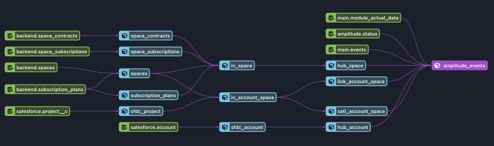
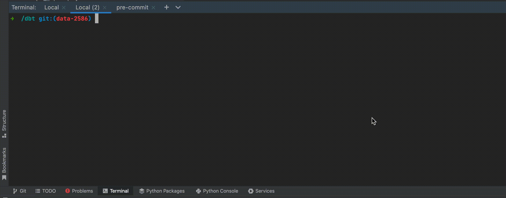

# dbt-snowflake-sandbox

In this repository you can find dbt macros that can help you to create a Snowflake 
isolated data sandbox by cloning model dependencies from source/production schemas.

The macro already expects the configured role has `SELECT` permissions to all dependencies
and it will clone models into your development schema that is configured in your `profiles.yml` config file.

## Installation

1. Copy `sandbox` dir into your macros directory in the dbt project
2. Copy `sandbox.sh` script into dbt project directory.
3. Add `sandbox.sh` into your PATH env variable

## How to run the macro

There are two ways:

1. Using pure dbt commands: `dbt run-operation sandbox_models --args '{models: [<model1>, <model2>, ...]}`
2. Using shell script wrapper to avoid writing long commands: `sandbox <model1> <model2> <model..n>`

## Example

Imagine the situation we would like to debug some issue in the `amplitude_events` model. To run the model in our schema we need
to have access to the data from production schemas. At the same time, we want to avoid situation when the source data will
change during our debugging - we want to make sure we work with the consistent dataset.
So we have to clone all models/tables into our schema.

## What's next

We are planning to create a dbt plugin for easy installation, but feel free to copy this code into your dbt project if it help
you with the development :) 